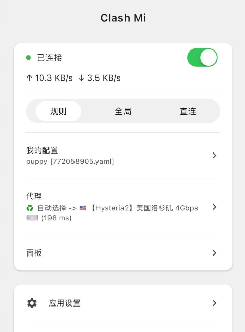

<h1 align="center">
  
  <br>
  Clash Mi - 又一款mihomo核心的代理工具
  <br>
</h1>

<h3 align="center">
基于 <a href="https://github.com/flutter/flutter">flutter</a> 的 <a href="https://github.com/MetaCubeX/mihomo">mihomo(clash.meta)</a> 图形用户界面。
</h3>

> [!IMPORTANT]
> **这是 fork 修改版(dai123x/clashmi-compat)**:针对国内网络(尤其是手机运营商网络)下的
> 清茶云订阅延迟问题做了默认值优化,基于上游 KaringX/clashmi 最新代码。
> - 📱 **手机上用官方版 Clash Mi 出现节点大面积超时/高延迟?** 不用装本 fork,
>   直接用 [compat/qingcha-mobile-fix.js](compat/README.md) 覆写脚本即可修复;
> - 🔍 排查过程与实测证据:[docs/COMPAT.md](docs/COMPAT.md);
> - ⚠️ Clash Mi 的 VPN 服务插件闭源(上游 issue [#372](https://github.com/KaringX/clashmi/issues/372)),
>   本 fork 无法发布安装包,仅提供源码级修改与兼容性校验 CI;
> - 以下为上游原 README。

## 特点
- 内置Mihomo内核
    - 基于最新且持续更新的Mihomo(Clash.Meta)内核. 内核及客户端均持续更新维护，放心使用.
- 操作简单
    - 支持metacubex的推荐配置, 内核基于yaml配置运行. 小白用户使用机场订阅即可使用.
- 自带[zashboard面板](https://github.com/Zephyruso/zashboard)
    - web面板 或许你更加熟悉.
- 官网/用户手册: [clashmi.app](https://clashmi.app)

## 推荐机场

- [清茶云](https://qingcha.fyi/register/?code=JYaLVRCv) —— 本仓库兼容修复所针对的订阅来源。

## 安装
- **IOS AppStore**: （搜索关键词：clash mi）
  - https://apps.apple.com/us/app/clash-mi/id6744321968
- **IOS TestFlight**:
  - https://testflight.apple.com/join/bjHXktB3
- **MacOS/Android/Windows/Linux**:
  - https://clashmi.app/download
  - https://github.com/KaringX/clashmi/releases/latest
  - ```sh
    brew install clash-mi
    ```


### 系统要求

- IOS >= 15
- MacOS >= 12 (Intel, Apple Silicon)
- Android >= 8  (arm64-v8a, armeabi-v7a)
- Windows >= 10 （amd64）
- Linux （amd64）

### 常见问题

> [FAQ|cn](https://clashmi.app/guide/faq)


### 截图

<div align="center">
  
  </br></br>
</div>

## Projects 

### 致谢: Clash Mi 基于或受到这些项目的启发：

- [flutter](https://flutter.dev/)：使构建美观应用变得轻松快捷.
- [mihomo](https://github.com/MetaCubeX/mihomo)：另一款 clash核心.
- [zashboard](https://github.com/Zephyruso/zashboard): 使用 Clash API 的仪表板.


### Karing Team:
- [Karing](https://karing.app): https://karing.app
- [Clash Mi](https://clashmi.app/): https://clashmi.app/
- [sing-poet](https://github.com/KaringX/sing-poet)

